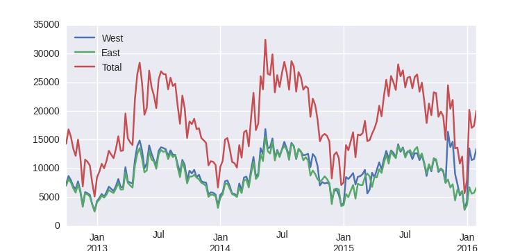
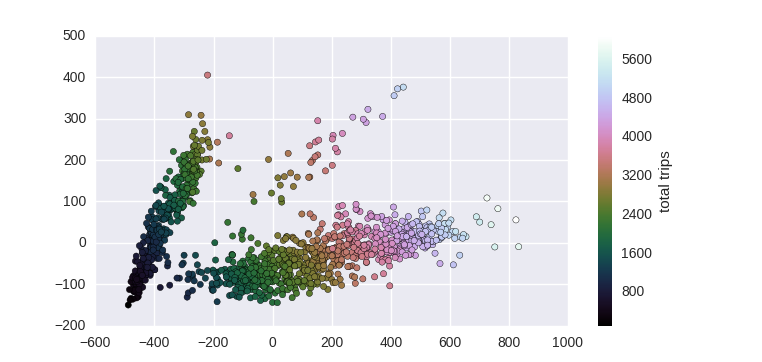
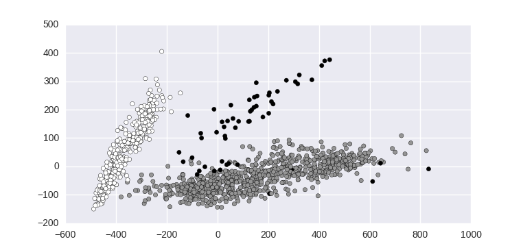
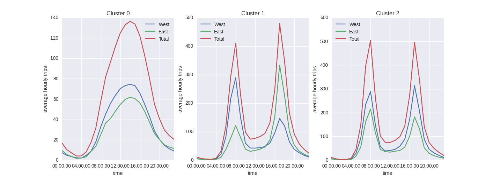
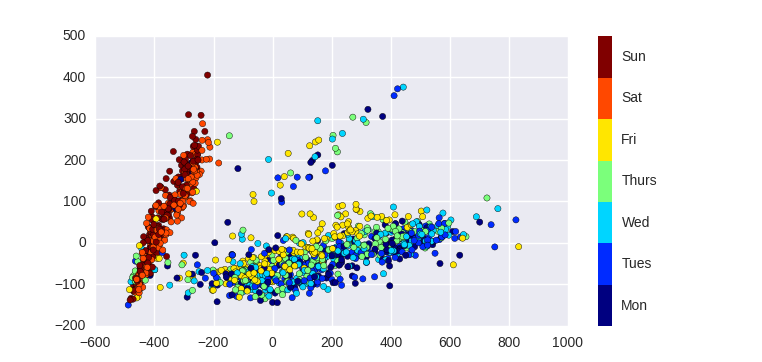

```{r setup, include=FALSE}
Sys.setlocale(locale='en_US.UTF-8')
library(knitr)
opts_chunk$set(fig.height=4, fig.width=8)
```

# Introduction

## Who

Iñaki Úcar

PhD Candidate & Teaching Assistant<br>
Dept. of Telematics Engineering<br>
Universidad Carlos III de Madrid

- http://www.it.uc3m.es/iucar
- http://www.enchufa2.es
- https://twitter.com/Enchufa2
- https://github.com/Enchufa2

## What (1)

[_Learning Seattle's Work Habits from Bicycle Counts_](https://jakevdp.github.io/blog/2015/07/23/learning-seattles-work-habits-from-bicycle-counts/)<br>**Pythonic Perambulations**<br>Jake VanderPlas

[_Learning Seattle's Work Habits from Bicycle Counts (with R!)_](https://rinzewind.org/blog-en/2015/learning-seattles-work-habits-from-bicycle-counts-with-r.html)<br>**Will do stuff for stuff**<br>José María Mateos (@Rinze)

## What (2)

Similarities and differences<br>in a day-to-day analysis with Python and R

- Data Reading
- Data Cleaning
- Data Transforming
- Some Analysis...
- Data Visualisation

# {data-background="img/python-logo.png"}

## Data Reading

```{python eval=F}
import pandas as pd
bikes = pd.read_csv('FremontBridge-14-02-2016.csv', 
                   index_col='Date', parse_dates=True)
bikes.head()
```

```
                     Fremont Bridge West Sidewalk  \
Date                                                
2012-10-03 00:00:00                             4   
2012-10-03 01:00:00                             4   
2012-10-03 02:00:00                             1   
2012-10-03 03:00:00                             2   
2012-10-03 04:00:00                             6   

                     Fremont Bridge East Sidewalk  
Date                                               
2012-10-03 00:00:00                             9  
2012-10-03 01:00:00                             6  
2012-10-03 02:00:00                             1  
2012-10-03 03:00:00                             3  
2012-10-03 04:00:00                             1
```
## Data Cleaning

```{python eval=F}
bikes.columns = ['West', 'East']
bikes.fillna(0, inplace=True)
bikes['Total'] = bikes.eval('East + West')
bikes.head()
```

```
                     West  East  Total
Date                                  
2012-10-03 00:00:00     4     9     13
2012-10-03 01:00:00     4     6     10
2012-10-03 02:00:00     1     1      2
2012-10-03 03:00:00     2     3      5
2012-10-03 04:00:00     6     1      7
```

## First Glance (1)

```{python eval=F}
weekly = bikes.resample('W', how='sum')
weekly.head()
```

```
            West  East  Total
Date                         
2012-10-07  7297  6995  14292
2012-10-14  8679  8116  16795
2012-10-21  7946  7563  15509
2012-10-28  6901  6536  13437
2012-11-04  6408  5786  12194
```

## First Glance (2)

```{python eval=F}
import matplotlib.pyplot as plt
import seaborn; seaborn.set()  # plot styling
weekly.plot()
plt.ylabel('weekly trips')
```



## Data Transforming

```{python eval=F}
X = bikes.pivot_table(['East', 'West'],
                          index=bikes.index.date,
                          columns=bikes.index.hour,
                          fill_values=0)
X.head()
```

```
           East                                    ... West                 \
             0  1  2  3  4   5   6    7    8    9  ...   14   15   16   17   
2012-10-03    9  6  1  3  1  10  50   95  146  104 ...   77   72  133  192   
2012-10-04   11  0  6  3  1  11  51   89  134   94 ...   63   73  114  154   
2012-10-05    7  4  3  2  2   7  37  101  119   81 ...   63   80  120  144   
2012-10-06    7  5  2  2  1   2  15   16   47   55 ...   89  115  107  107   
2012-10-07    5  5  1  2  2   3   8   12   26   36 ...  126  122  132  118   

                                     
             18  19  20  21  22  23  
2012-10-03  122  59  29  25  24   5  
2012-10-04  137  57  27  31  25  11  
2012-10-05  107  42  27  11  10  16  
2012-10-06   41  40  25  18  14  15  
2012-10-07   68  26  19  12   9   5
```

## PCA Analysis (1)

```{python eval=F}
from sklearn.decomposition import PCA
Xpca = PCA(0.9).fit_transform(X.values)
Xpca.shape
```

```{python eval=F}
(1216, 3)
```

## PCA Analysis (2)

```{python eval=F}
total_trips = X.values.sum(1)
plt.scatter(Xpca[:, 0], Xpca[:, 1], c=total_trips, cmap='cubehelix')
plt.colorbar(label='total trips');
```



## Clustering

```{python eval=F}
from sklearn.mixture import GMM
gmm = GMM(3, covariance_type='full', random_state=0)
gmm.fit(Xpca)
cluster_label = gmm.predict(Xpca)
plt.scatter(Xpca[:, 0], Xpca[:, 1], c=cluster_label)
```



## Average Trend (1)

```{python eval=F}
X['Cluster'] = cluster_label
bikes = bikes.join(X['Cluster'], on=bikes.index.date)
by_hour = bikes.groupby(['Cluster', bikes.index.time]).mean()
by_hour.head()
```

```
                      West      East      Total
Cluster
0       00:00:00  7.480211  9.889182  17.369393
        01:00:00  4.934037  5.601583  10.535620
        02:00:00  3.574468  3.678191   7.252660
        03:00:00  2.387435  1.764398   4.151832
        04:00:00  2.013193  2.110818   4.124011
```

## Average Trend (2)

```{python eval=F}
import numpy as np
fig, ax = plt.subplots(1, 3, figsize=(14, 5))
hourly_ticks = 4 * 60 * 60 * np.arange(6)
for i in range(3):
    by_hour.ix[i].plot(ax=ax[i], xticks=hourly_ticks)
    ax[i].set_title('Cluster {0}'.format(i))
    ax[i].set_ylabel('average hourly trips')
```



## Seattle's Work Habits

```{python eval=F}
dayofweek = pd.to_datetime(X.index).dayofweek
plt.scatter(Xpca[:, 0], Xpca[:, 1], c=dayofweek, cmap=plt.cm.get_cmap('jet', 7))
cb = plt.colorbar(ticks=range(7))
cb.set_ticklabels(['Mon', 'Tues', 'Wed', 'Thurs', 'Fri', 'Sat', 'Sun'])
plt.clim(-0.5, 6.5)
```



# {data-background="img/R-logo.png"}

## Data Reading

```{r warning=F, message=F}
bikes <- read.csv("FremontBridge-14-02-2016.csv")
head(bikes)
```

## Data Cleaning

```{r warning=F, message=F}
bikes$Date <- as.POSIXct(bikes$Date, format="%m/%d/%Y %r")
names(bikes) <- c("Date", "West", "East")
bikes[is.na(bikes)] <- 0
bikes$Total <- with(bikes, West + East)
head(bikes)
```

## First Glance (1)

```{r warning=F, message=F}
library(dplyr); library(tidyr)
weekly <- bikes %>% 
  gather(zone, count, -Date) %>%
  mutate(week=format(Date, format="%Y-%U")) %>% 
  group_by(week, zone) %>%
  summarise(count=sum(count), Date=min(Date))
head(weekly)
```

## First Glance (2)

```{r warning=F, message=F}
library(ggplot2)
ggplot(weekly) + geom_line(aes(x=Date, y=count, color=zone)) +
  ylab("Weekly trips")
```

## Data Transforming

```{r warning=F, message=F}
bikes$hour <- strftime(bikes$Date, "%H")
bikes$Date2 <- as.Date(bikes$Date, tz="")
X <- bikes %>%
  gather(zone, count, East, West) %>%
  unite(zone_hour, zone, hour) %>%
  group_by(Date2, zone_hour) %>%
  summarise(count=sum(count)) %>%
  spread(zone_hour, count, fill=0)
head(X)
```

## PCA Analysis (1)

```{r warning=F, message=F}
pca1 <- prcomp(X[, -1])
cumvar <- cumsum(pca1$sdev^2 / sum(pca1$sdev^2))
cumvar[1:5]
Xpca <- as.data.frame(pca1$x[, 1:3])
names(Xpca) <- c("PC1", "PC2", "PC3")
Xpca$Date2 <- X$Date2
```

## PCA Analysis (2)

```{r warning=F, message=F}
Xpca$total_trips <- rowSums(X[, -1])
ggplot(Xpca) + 
  geom_point(aes(x=PC1, y=PC2, color=total_trips), alpha=0.7) +
  scale_colour_distiller(type="qual", palette=6, direction=1)
```

## Clustering

```{r warning=F, message=F}
library(mclust)
Xpca$clusters <- Mclust(Xpca[, c("PC1", "PC2", "PC3")], G=3, 
                        prior=priorControl())$classification
ggplot(Xpca) + 
  geom_point(aes(x=PC1, y=PC2, color=factor(clusters)), alpha=0.7)
```

## Average Trend (1)

```{r warning=F, message=F}
by_hour <- bikes %>%
  left_join(Xpca[, c("clusters", "Date2")], by="Date2") %>% 
  group_by(hour, clusters) %>%
  summarise_each(funs(mean), -Date, -Date2) %>% 
  gather(zone, count, -hour, -clusters)
by_hour$hour <- as.numeric(by_hour$hour)
head(by_hour)
```

## Average Trend (2)

```{r warning=F, message=F}
ggplot(by_hour) +
  geom_line(aes(x=hour, y=count, group=zone, color=zone)) +
  facet_wrap(~ clusters) +
  xlab("Hour") + ylab("Average trips per hour\n")
```

## Seattle's Work Habits

```{r warning=F, message=F}
Xpca$weekday <- Xpca$Date2 %>% weekdays(abbreviate=T) %>%
  factor(levels=c("Mon", "Tue", "Wed", "Thu", "Fri", "Sat", "Sun"))
ggplot(Xpca) + 
  geom_point(aes(x=PC1, y=PC2, color=weekday), alpha=0.7) +
  scale_color_brewer(palette="Paired")
```

# Side Notes

## Data Reading

- Python
    - External library
    - OOP style
    - Built-in date parsing
    - Outstanding time series support
- R
    - Base R
    - Particular syntax
    - Time series are a PITA

## Data Cleaning

- R
    - **VERY** particular syntax: <br>`names(bikes) <- ...`
    - Data frame indexing
    - Column accessing

## First Glance (1)

- Python
    - `resample`!
- R
    - Pipes!
    - More work, but more **verbal**
    - Tidy data... beg your pardon?

## First Glance (2)

What is Tidy Data?

> Happy families are all alike; every unhappy family is unhappy in its own way <br>— Leo Tolstoy

- One variable per column
- **One observation per row**

<span style="font-size:60%">Hadley Wickham. [**Tidy data**](http://vita.had.co.nz/papers/tidy-data.html). _The Journal of Statistical Software_, vol. 59, 2014.</span>

## Data Transforming

- Python
    - `pivot_table`!
    - Groups of columns (zone, hour)
- R
    - Again, more work, but more **verbal**
    - Auxiliar columns

## PCA Analysis (1)

- Python
    - _Import then run_ style
- R
    - _I know what I'm doing_ style
    - ... and let's return to our beloved data frame

## PCA Analysis (2)

- Python
    - Nice default colors
- R
    - Inferred color bar

## Clustering

- Python
    - Define the object
    - Fit
    - Predict
- R
    - Mclust... done!

## Average Trend (1)

- Very similar
- Tidy vs. untidy data

## Average Trend (2)

- Python
    - `for` loop
- R
    - Faceting
    - Same scale by default

## {data-background="img/happy-bbrothers.gif"}

<br><br><br><br><br><br><br><br><br><br>
<span style="color:white; font-size:70px">Thanks!</span>

<span style="color:white; font-size:50px">Python <strike>vs.</strike> & R, BigData Brothers</span>
